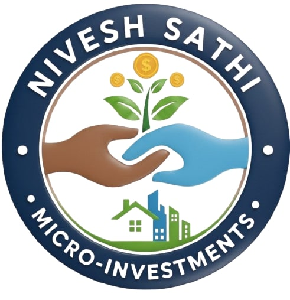

# 💰 Nivesh Sathi - निवेश साथी

> **Democratizing investment for every Indian, one ₹10 at a time.**

A lightweight micro-investment PWA designed for first-time Indian investors, especially targeting rural and semi-urban users with low financial literacy.



## 🎯 Problem Statement

- 76% of Indians don't invest due to lack of knowledge and high entry barriers
- Existing platforms are complex and require large minimum investments
- Rural users face language barriers and poor internet connectivity
- First-time investors lack trust in digital financial platforms

## 💡 Our Solution

**Nivesh Sathi** makes investing accessible by:
- Starting with just **₹10** (cost of a samosa!)
- **Hindi + English** bilingual support
- **Offline-first** PWA architecture
- **Jargon-free** financial education
- **Trust-focused** UI with regulatory badges

## ✨ Key Features

### 1. 🔐 Simple Sign Up/Sign In
- Name, Mobile, Age, Password
- Bilingual (Hindi/English)
- Duplicate account detection

### 2. 💵 Micro-Investment (₹10 minimum)
- Government Bonds
- Fixed Deposits
- Recurring Deposits
- Low-risk Mutual Funds
- Clear risk indicators (Low/Medium/High)

### 3. 📚 Financial Education
- "Learn before you invest" flow
- 4 simple lessons with progress tracking
- Jargon-free explanations

### 4. 🔥 Daily ₹10 Habit
- Streak counter for consecutive savings
- Gamified savings motivation

### 5. 💳 Mock UPI Payment
- GPay, PhonePe, Paytm integration (mock)
- Clear fee breakdown (₹0 platform fee)

### 6. 📊 Portfolio Tracking
- Real-time value display
- Returns calculation
- Offline viewing support

### 7. 🌐 Offline Support
- PWA with service worker
- Cached portfolio viewing
- Works on 2G/3G networks

### 8. 🎉 Money Story
- Relatable investment messages
- "You saved the cost of 1 samosa for your future 🥟"

## 🛠️ Tech Stack

| Layer | Technology |
|-------|------------|
| Frontend | React 18 + Vite |
| State | React Context + localStorage |
| Styling | CSS (no frameworks) |
| Icons | react-icons |
| PWA | vite-plugin-pwa |
| Backend | Express.js (mock) |

## 🚀 Quick Start

```bash
# Clone the repository
git clone https://github.com/arpitvarshney44/GFGBQ-Team-Duo.git
cd GFGBQ-Team-Duo

# Install dependencies
npm install

# Start development server
npm run dev
```

Open `http://localhost:5173` in your browser.

### Backend (Optional)
```bash
cd backend
npm install
node index.js
```

## 📱 Demo Flow

1. **Sign Up** → Enter name, mobile, age, password
2. **Learn** → Complete 2+ lessons
3. **Invest** → Select option → Choose ₹10 → Pay via UPI
4. **Track** → View portfolio with returns
5. **Habit** → Save ₹10 daily, build streak

## 🎯 Target Users

- First-time investors
- Rural and semi-urban population
- Low-income individuals
- Users with low financial literacy
- Users on low-end smartphones

## 🏆 Hackathon Highlights

- ✅ Complete working prototype
- ✅ Bilingual (Hindi + English)
- ✅ Offline-first architecture
- ✅ Mobile-responsive design
- ✅ Trust-focused UI
- ✅ Gamified savings habit
- ✅ Clean, minimal codebase

## 📂 Project Structure

```
nivesh-sathi/
├── src/
│   ├── components/
│   │   ├── auth/        # Login/SignUp
│   │   ├── common/      # Header, Nav, Badges
│   │   ├── education/   # Learning modules
│   │   ├── home/        # Home, DailyHabit
│   │   ├── investment/  # Investment flow
│   │   ├── portfolio/   # Portfolio view
│   │   └── profile/     # User profile
│   ├── context/         # State management
│   ├── services/        # Mock APIs
│   ├── utils/           # Translations, helpers
│   └── styles/          # Global CSS
├── backend/             # Express mock server
└── public/              # PWA assets
```

## 👥 Team

**GFGBQ-Team-Duo**

## 📄 License

MIT License

---

> *"छोटी बचत, बड़े सपने"* - Small savings, big dreams 🌟
